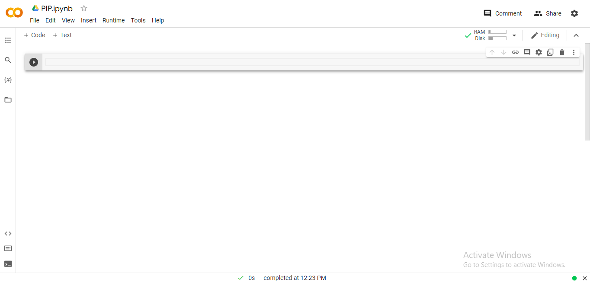

# Pertemuan15

## PIP
* PIP merupakan package manager untuk mengelola package dan modul pada python.
* Dengan menggunakan PIP, kita dapat menggunakan library yang tersedia bebas dari directory package library python.
* Untuk dapat menggunakan PIP, perlu diinstall terlebih dahulu, silahkan kunjungi tautan berikut untuk proses instalasinya: https://pypi.org/project/pip/

### Perintah Dasar PIP
* `pip --version ->` menampilkan versi PIP yang terinstall.
* `pip install nama_package ->` menginstall package.
* `pip uninstall nama_package ->` menghapus package.
* `pip list ->` untuk menampilkan daftar package yang terinstall.

### Contoh Penggunaan
* PIP List


## Web Scraping Menggunakan Python
### Introducing
* Data Scraping adalah suatu teknik dalam mengumpulkan data dari berbagai sumber data.
* Salah satunya adalah dari website, sehingga lebih dikenal dengan Web Scraping.
* Secara Umum ada dua teknik dalam Web Scraping yaitu *Manual* (copy paste), dan *Otomatis* (dengan software/tools).

### Teknik Web Scraping
* Menyalin data secara manual
* Menggunakan regular expression
* Parsing data HTML
* Menggunakan DOM
* Menggunakan XPath
* Menggunakan Google Sheet

### Tools Yang Digunakan
* Python
* Requests
* BeautifulSoup
* Google Colab

#### Python
1. Kunjungi tautan berikut untuk proses instalasinya: https://www.python.org/
2. Kemudian Install Python 3.11.1
3. Selanjutnya buka Command Prompt.
4. Selanjutnya ketik *Python* untuk melihat versi python yang telah terinstall.


#### Requests
* Requests merupakan library HTTP untuk proses mengirim dan mengambil data menggunakan protokol HTTP.
* Untuk menginstallnya menggunakan perintah pip *pip install requests* 
* Jika sudah terinstall maka saat *pip list* akan muncul seperti pada gambar di bawah:


#### BeautifulSoup
* BeautifulSoup merupakan library yang digunakan untuk proses web scraping halaman HTML dan XML.
* Untuk menginstallnya menggunakan perintah pip, seperti pada gambar di bawah:


* Untuk melihat daftar package yang telah terinstall gunakan perintah `pip list`


#### Pandas
* Pandas adalah library open source pada Python yang sering digunakan untuk memproses data yang meliputi pembersihan data, manipulasi data, hingga melakukan analisis data. Ketika melakukan suatu analisis, kita tidak bisa menggunakan data mentah.
* Penggunaan Pandas umumnya disingkat menjadi pd. Format penulisan saat akan memanggil library Pandas adalah `import pandas as pd`. Ingat untuk selalu import library yang akan digunakan terlebih dahulu. 
* Untuk menginstallnya menggunakan perintah pip, seperti pada gambar di bawah:


* Untuk melihat daftar package yang telah terinstall gunakan perintah `pip list`


#### Google Colab
1. Kunjungi tautan berikut untuk membuat project baru: https://colab.research.google.com/
2. Kemudian klik *File*
3. Kemudian Buat *Notebook Baru*
4. Beri nama proyeknya

5. Kemudian Import Library yang telah kita install sebelumnya, untuk tampilannya seperti di bawah:
```sh
import requests
from bs4 import BeautifulSoup
import pandas as pd
```
6. Kemudian ketik program yang akan dijalankan (Saya menggunakan program *Studi Kasus 4: BukaLapak (URL : https://www.bukalapak.com/c/komputer/laptop?from=nav_header)*)
```sh
URL = "https://www.bukalapak.com/c/komputer/laptop?from=nav_header"
page = requests.get(URL)

SOUP = BeautifulSoup(page.content, "html.parser")
produk = SOUP.find_all("div", "bl-product-card__description")

data = []
for item in produk:
  nama = item.select(".bl-product-card__description-name")
  price = item.select(".bl-product-card__description-price p")
  data.append({"nama": nama[0].text.strip(), "harga": price[0].text.strip()})

#print data
df = pd.DataFrame(data)
print(df)
```
7. Untuk tampilan lengkapnya sebagai berikut:


8. Jika sudah benar dan berhasil di RUN maka akan menghasilkan output seperti gambar di bawah:
